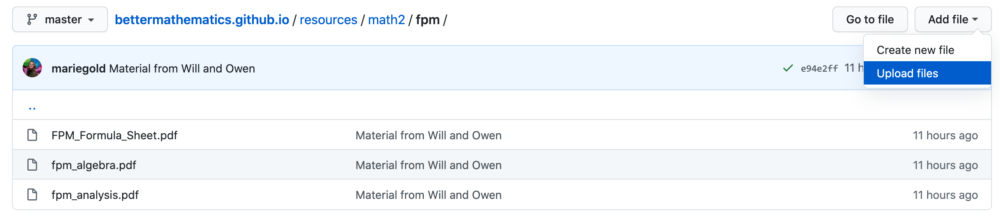
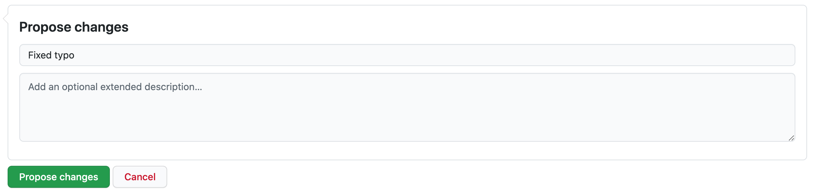
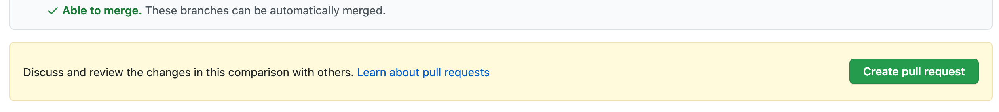
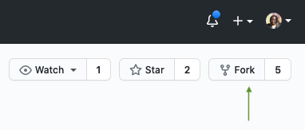
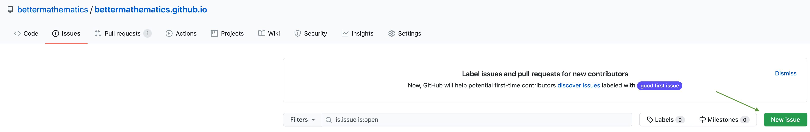

# Contributing to Better Mathematics

As Better Mathematics is an open source website, any contributions from the community are greatly appreciated and encouraged. This document details the guidelines for making contributions to Better Mathematics.

At first, the process of contributing might seem a bit daunting, but it really isn't! This guide aims to be as clear as possible and give step-by-step instructions on how to contribute. The more you do it, the easier it gets!

<details>
	<summary>
		<b>Click here to see the table of contents. You can use it to jump to any relevant section.</b>
	</summary>

- [Getting started](#getting-started)
  - [GitHub](#github)
  - [Markdown](#markdown)
  - [YAML](#yaml)
- [Types of contributions](#types-of-contributions)
  - [Adding or modifying shared resources](#adding-or-modifying-shared-resources)
    - [Making your changes and creating a pull request](#making-your-changes-and-creating-a-pull-request)
  - [Adding a course or modifying course details](#adding-a-course-or-modifying-course-details)
  - [Adding or modifying a feature on the website (advanced)](#adding-or-modifying-a-feature-on-the-website-advanced)
  - [Fixing typos, broken links and other minor bugs](#fixing-typos-broken-links-and-other-minor-bugs)
- [Creating a new folder](#creating-a-new-folder)
- [Running the code locally (advanced)](#running-the-code-locally-advanced)
- [Returning editors](#returning-editors)
</details>

## Getting started

### GitHub

The code for this website is public and can be accessed on [GitHub](https://github.com/bettermathematics/bettermathematics.github.io). That way anyone can contribute to it – you don't even have to know much about git.

Before you can start making any sort of contribution though, you'll need to set up a GitHub account if you don't already have one. It is completely free of charge, in fact as a student you get many [benefits](https://education.github.com/pack).

### Markdown

The content of Better Mathematics is written in markdown. If you don't know it already, have a look at this [Markdown reference](https://support.typora.io/Markdown-Reference/) to get you started.

### YAML

If you are looking to add a new course or modify details for an already existing course, then you might need some knowledge of a language called YAML. [Here](https://gettaurus.org/docs/YAMLTutorial/) is a great guide that introduces it.

## Types of contributions

There are a number of different kinds of contributions you can make to Better Mathematics. In this section we will explain the steps involved in each one.

### Adding or modifying shared resources

The most common type of contribution is simply adding a resource for others to use, for a specific course. This can be anything, ranging from videos explaining a topic, to cheatsheets and interactive/visual tools.

All you have to do is go to the specific section for the course you wish to edit on the Better Mathematics website, and click on _Edit on GitHub_.


You will then be asked to _Fork_ the repository, which creates a copy of the code for you to edit. Once you confirm, an editor will appear and you are ready to change or add content to the Markdown file for the course you chose to edit.

The structure of each course file roughly follows the below layout. When adding a resource, you simply want to add it to the list under the `Resources` section. If the course does not yet have this section, just create it.

<details>
	<summary>
		<b>Click here to see the Markdown file layout.</b>
	</summary>

```markdown
---
Course details go here (you don't need to worry about this section)
---

Course summary goes here

**Main topics**: Topic A, Topic B, ...

#### Resources

- [Resource A](https://www.resource-a.com)
- [Resource B](resources/mathX/course-acronym/resource-b.pdf)
- Your resource goes here
```
</details>

You will typically be adding a Markdown link to either:

- an external resource on some other website (see the `Resource A` example above),
- a link to a file you've uploaded on the Better Mathematics website (see the `Resource B` example above).

If you need to add a file, go to the [resources directory on GitHub](https://github.com/bettermathematics/bettermathematics.github.io/tree/master/resources) and choose the folder for year that the course is in (`math1`, `math2`, etc.). Within each year folder, each course has its own dedicated sub-folder, named using the course acronym in lowercase ([create it if it doesn't exist!](#creating-a-new-folder)). Once in this sub-folder, you can simply upload the files.



Then, when you are linking this resource in the course Markdown file, use the following syntax: `resources/mathX/course-acronym/filename.format`. For instance, the following code will create a hyperlink to the Algebra cheatsheet for the second year Fundamentals of Pure Mathematics course:

```markdown
[Algebra cheatsheet](resources/math2/fpm/fpm_algebra.pdf) by Marie
```

#### Making your changes and creating a pull request

When you're done, give us a brief desciption of what you did and press the *Propose changes* button.



> **Note**: You may need to propose changes twice and make two separate pull requests if you are uploading a resource: once for adding the file to the `resources` folder, and once for adding the link to the correct Markdown file.

Next, you will have to create a pull request (PR), and confirm it one more time in the *Open a pull request* form.



And that's you done! Someone will review your pull request and merge your changes into the master branch.

### Adding a course or modifying course details

1. **Add the course to the `_data/courses.yml` file.**

   The [`_data/courses.yml`](https://github.com/bettermathematics/bettermathematics.github.io/blob/eonu/contributing/_data/courses.yml) file contains all of the necessary information to define a course (in YAML format). It is important that you enter the details for your new course correctly, as the website automatically generates the section for each course based on this information.

   **Please make sure that the course you are adding does not already exist!**

   > **Note**: We are aiming to write a script that will extract the course information from a spreadsheet file that is provided by the School of Mathematics every September 1st on the SharePoint drive. If anyone is interested in helping out with this script, please make an issue or [contact us](mailto:bettermathematicsuoe@gmail.com).
   >
   > This script will help eliminate the need to manually copy the information for each new course. The script will also come in handy because details for already existing courses may change from time to time. The script would ideally be able to automatically generate the entire `_data/courses.yml` file from the data in the spreadsheet.
   >
   > Once this script is working, there will probably be no need for you to ever have to manually add a new course. For now though, there is a possibility that we missed a course when we were adding them, so continue reading to learn how to add or modify a course.

   Let's have a look at the YAML entry for the _Statistics (Year 2)_ course:

   <details>
      <summary>
       <b>Click here to see the example YAML entry.</b>
      </summary>

   ```yaml
   sta2:
       acronym: Sta2
       credits: 10
       cw_exam_ratio:
         - 20
         - 80
       delivery: S2
       delivery_ordinal: 2
       diet: April/May
       euclid_code: MATH08051
       euclid_url: http://www.drps.ed.ac.uk/20-21/dpt/cxmath08051.htm
       level: 08
       name: Statistics (Year 2)
       year: 2
   ```
   </details>

   We'll now go through each of the keys above and explain what they mean and what values you should put for each one. Most of the information can be found on the [DRPS]( http://www.drps.ed.ac.uk/) page for that specific course.

   <details>
      <summary>
       <b>Click here to see an explanation of each key.</b>
      </summary>

   1. Top-level course acronym - This should be the acronym of the course in lowercase. All of the other keys should go under this one.

   2. `acronym` - This should be the same as the course acronym, but capitalized appropriately.

      >  e.g. `sta2` might become `Sta2`, or `bdan` might become `BDAn`.

   3. `credits` - The number of SCQF credits.

   4. `cw_exam_ratio` - The coursework-exam ratio for the course. This key takes a list of two values.

   5. `delivery` - The semester that the course is delivered in (as a string). This will be one of:

      1. `S1` - runs in the first semester,
      2. `S2` - runs in the second semester,
      3. `YR` - runs in both the first and second semester (year-long courses, typically undergraduate dissertations),
      4. `B5+` - runs over summer (typically Masters dissertations).

   6. `delivery_ordinal` - A numerical identifier for the `delivery` semester. This is simply the position in the above list.

      >  e.g. If `delivery` was `S2`, then `delivery_ordinal` would be `2`. If it was `B5+`, then `delivery_ordinal` would be `4`.

   7. `diet` - The month(s) that the exam for the course runs in. This will be one of:

      - `December` - if the exam is at the end of the first semester,
      - `April/May` - if the exam is at the end of the second semester,
      - `''` - if the course does not have an exam.

   8. `euclid_code` - The course code (found on the DRPS).

      >  e.g. `MATH11043`

   9. `euclid_url` - The URL for the DRPs page for the course (make sure it's for the current year!).

   10. `level` - The SCQF credit level.

   11. `name` - The full name of the course.

   12. `year` - The year that the course is typically taken in.
   </details>

   Add your course entry anywhere under the top-level `list` dictionary. Preferably, courses should be sorted chronologically based on the date they were uploaded, so putting it at the top would be best.

   Finally, update the `last_update` value at the top of the file to reflect the time you made the update.

2. **Create the course Markdown file.**

   Once you've added the course to the `_data/courses.yml` file, you need to make a Markdown file for the course.

   Navigate to the sub-folder under [`_sections`](https://github.com/bettermathematics/bettermathematics.github.io/tree/master/_sections) for the year your course typically runs in, and create a Markdown file using the lowercase course acronym.

   > e.g. If you were adding the Statistics (Year 2) course, which has acronym `sta2`, then you would create a Markdown file at the following path:
   >
   > `_sections/math2/sta2.md`

   Once you've made the file, copy the below template and modify the `title`, `course-acronym` and `year` fields so that they match the details in `_data/courses.yml`. Note that `course-acronym` here is actually the lowercase acronym.

   <details>
      <summary>
       <b>Click here to view the Markdown file template.</b>
      </summary>

   ```markdown
   ---
   title: Statistics (Year 2)
   course-acronym: sta2
   year: 2
   ---

   Course summary goes here

   **Main topics**: Topic A, Topic B, ...

   #### Resources

   None yet!
   ```
   </details>

   You should also add a summary and main topics. If you have any resources you'd like to share, add them under the `Resources` heading.

   You can also add special links for the course, which will appear next to the course title on the Better Mathematics section.

   <details>
      <summary>
       <b>Click here to see an example of adding links.</b>
      </summary>

   > e.g. This is how you would add a link for the _Calculus and its Applications_ course.
   >
   > ```yaml
   > ---
   > title: Calculus and its Applications
   > course-acronym: cap
   > year: 1
   > links:
   >   - name: webassign
   >     url: https://www.webassign.net/login.html
   > ---
   > ```
   >
   > This would appear like this on the Better Mathematics website:
   >
   > 
   </details>

3. **Create a resource sub-folder for the course.**

   The last step is to create a sub-folder for the course in the [`resources`](https://github.com/bettermathematics/bettermathematics.github.io/tree/master/resources) folder. This folder is where others will be able to add resources such as cheatsheets and notes for the course you added.

   On GitHub, navigate to `resources/mathX`, where `X` is the year the course typically runs in. Once in this folder, you will need to [create a new folder](#creating-a-new-folder) using the lowercase course acronym as the name.

If you are modifying details for an existing course, make sure you do it in both `_data/courses.yml` and the Markdown file for the course!

Making these changes through the GitHub interface may be tedious, so you may want to try [running the code locally](#running-the-code-locally-advanced) and doing everything through an editor.

Otherwise, if you are doing everything through GitHub, follow the instructions on [making your changes and creating a pull request](#making-your-changes-and-creating-a-pull-request). Once again, you may have to make multiple pull requests.

### Adding or modifying a feature on the website (advanced)

To add or modify a feature on the website, you'll need to first make sure you can [run the code locally](#running-the-code-locally-advanced) on your own forked and cloned repository. Once you can successfully run the web server, you can start working on your feature by creating a new branch.

#### Making a new branch

To make a new branch, run the following command:

```bash
git checkout -b username/short-description
```

Where `username` is your GitHub username and `short-description` is a short description of the change you will be making.

> e.g. If the user `eonu` was fixing course details for the _Honours Algebra_ (`halg`) course, a sensible branch name would be `eonu/fix-halg`.

#### Committing your changes

Once in your new branch, you can make any changes you want. When you're finished doing this, make sure you launch the server and check that your changes look fine.

If you're satisfied, then you can make a commit and push it to your fork which is hosted on your GitHub account.

```bash
# Add all of the files to be staged for a commit
git add .

# Create a commit (use a short, sensible and descriptive commit message)
git commit -m "Changed Honours Algebra from 10 to 20 credits"

# Push the changes to your fork on GitHub
git push origin username/short-description
```

Where `username/short-description` is the name of the branch that you made earlier, and that you are currently working on.

#### Making a pull request

Finally, we need to merge your fork of Better Mathematics with the original repository. To do this, go to the pull request page of your fork on GitHub, which would be at `https://github.com/<username>/bettermathematics.github.io/pulls` (replacing `<username>` with your username).

Near the top right, you should see a green button that says _New pull request_. Press this button and give your pull request a simple title and description explaining what you've changed.

When you're ready, make the pull request and just wait until someone approves and merges your changes!

### Fixing typos, broken links and other minor bugs

Small changes like these can be done in a similar way to [adding or modifying shared resources](#adding-or-modifying-shared-resources) — just go to the section on the Better Mathematics website that you would like to fix, press the _Edit on GitHub_ button, and follow the same steps.

## Creating a new folder

Unfortunately, creating a new folder through the GitHub interface is not as simple as it should be. The main reason for this is that GitHub tracks changes to files rather than directories. This means that GitHub actually wouldn't recognize an empty folder.

One common trick is to create a new folder and simultaneously place a hidden file (typically called `.gitkeep`) in it.

This [StackOverflow answer](https://stackoverflow.com/a/34259067) explains how to do this very clearly.

## Running the code locally (advanced)

If you are making a larger change to the website, you will probably want to run the code locally to test your changes before you make a pull request to officially change it on the Better Mathematics website.

This is quite a bit more advanced than using the GitHub interface, so I only suggest doing this if you are a very serious contributor.

### Requirements

- [Ruby programming language](https://www.ruby-lang.org/en/downloads/) — the latest stable version should do. You should install this using a Ruby version manager such as [rbenv]() instead of downloading the programming language directly. This allows you to easily switch between different versions of Ruby, and generally makes your life easier.
- [Git (command-line interface)](https://git-scm.com/downloads)
- A good editor like [VSCode](https://code.visualstudio.com/)

### Forking and cloning

Once you have set up all of the requirements above, you will need to _fork_ the Better Mathematics repository, which basically just makes a copy of Better Mathematics on your GitHub account. You can do this from the [Better Mathematics](https://github.com/bettermathematics/bettermathematics.github.io) repository page by pressing the _Fork_ button at the top right of the page:



Once you have created a fork, you will need to _clone_ the fork, which basically makes a local copy of the repository on your own computer.

You can do this using the following command in your terminal, (replacing `<username>` with your GitHub username):

```bash
git clone https://github.com/<username>/bettermathematics.github.io.git
```

### Installing dependencies

Next, you will need to install all of the dependencies for Better Mathematics. You can do this with the following command in your terminal:

```bash
bundle install
```

If this doesn't work, then run `gem install bundler` to install the `bundler` package. Bundler is package manager for Ruby, and helps to determine and install the appropriate package versions for your application.

### Running the application

One package (or _gem_ in Ruby-speak) that should have been installed is [Jekyll](https://jekyllrb.com/), which is basically an engine that converts Markdown files into HTML files and starts a web server that allows you to view those files.

To test that everything works now, run the following command to launch the web server:

```bash
bundle exec jekyll serve
```

Now you can type `localhost:4000` in the address bar on any browser, and you should see your own locally running copy of Better Mathematics! This allows you to make changes to the website and see them immediately, instead of making a pull request, waiting for it to be approved, only to find out that you've broken the entire live website.

Normally, you will have to restart the server any time you edit a file. However, you can also run the following launch command which will keep watching for any changes, and automatically restart the server if there are any:

```bash
bundle exec jekyll serve --watch
```

### Modifying the code

Now that you know how to get a copy of the website running locally, you can start trying to make any change you want and see how it looks.

Of course there are a lot of different parts of the website that you can change, so we won't detail them here, but depending on what you're doing, you may need to know [YAML](https://gettaurus.org/docs/YAMLTutorial/), [Markdown](https://support.typora.io/Markdown-Reference/), [HTML](https://html.com/), [CSS](https://developer.mozilla.org/en-US/docs/Learn/CSS/First_steps) and [Liquid](https://shopify.github.io/liquid/) languages.

## Returning editors

If you are an active user, please let us know and we will make it a bit easier for you to edit by adding you as a contributor to the repository. You should do this preferably by raising an *Issue* on GitHub, where you simply ask to be assigned the role.



We require that someone reviews your code before it is merged, because we don't want anyone to accidentally break the website (it happens to all of us). When you become a contributor, you can start reviewing and approving the code too!

If you are more proficient with git, feel free to use the command line interface.

---

<p align="center">
   See a typo? Or a broken link? Fix it please! Found a cool video on Laplace transforms? Share it!
</p>

<p align="center">
   If you need any help, <a href="mailto:bettermathematicsuoe@gmail.com">drop us an email</a> or <a href="https://github.com/bettermathematics/bettermathematics.github.io/issues/new">create an issue</a> :blush:
</p>

<p align="center">
   
</p>